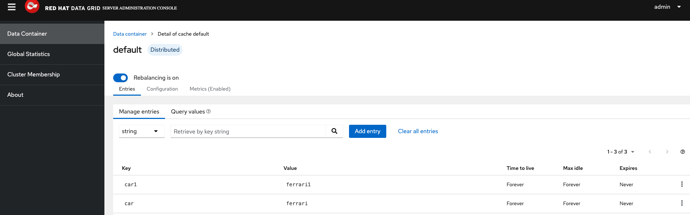

### This article shows the client code config to access a DataGrid cluster using Scala. Scala uses Java Hot Rod client provided as part of DataGrid product.

- Setup sbt (Scala Build Tool). [Instructions](https://docs.scala-lang.org/getting-started/sbt-track/getting-started-with-scala-and-sbt-on-the-command-line.html)

- Create Scala Project. [Instructions](https://docs.scala-lang.org/getting-started/sbt-track/getting-started-with-scala-and-sbt-on-the-command-line.html)

- Add Java Hot Rod client POM Maven dependencies in [build.sbt](build.sbt)
```
libraryDependencies += "org.infinispan" % "infinispan-commons" % "14.0.6.Final",
libraryDependencies += "org.infinispan" % "infinispan-client-hotrod" % "14.0.6.Final"   
```

- Open the .scala file in project created to add client code
```
import org.infinispan.client.hotrod.RemoteCacheManager
import org.infinispan.commons.api.BasicCache
import org.infinispan.commons.api.BasicCacheContainer

@main def hello() =
            println("Hello, World!")
            val cb = new org.infinispan.client.hotrod.configuration.ConfigurationBuilder();
            cb.tcpNoDelay(true)
                .connectionPool()
                .security().authentication().username("admin").password("changeme")
                .addServer()
                .host("192.168.86.28")
                .port(11222)
            val cacheContainer = new RemoteCacheManager(cb.build())
            val cache : BasicCache[String,String] = cacheContainer.getCache("default")
            cache.put("car1", "ferrari1")
            println(cb);
```
- Open promt at project level and exec "sbt run".
```
svalluru@svalluru-mac hello-world % sbt run
[info] welcome to sbt 1.8.2 (Homebrew Java 19.0.2)
[info] loading project definition from /Users/svalluru/Downloads/scala/hello-world/project
[info] loading settings for project root from build.sbt ...
[info] set current project to hello-world (in build file:/Users/svalluru/Downloads/scala/hello-world/)
[info] compiling 1 Scala source to /Users/svalluru/Downloads/scala/hello-world/target/scala-3.2.2/classes ...
[info] running hello
Hello, World!
SLF4J: Failed to load class "org.slf4j.impl.StaticLoggerBinder".
SLF4J: Defaulting to no-operation (NOP) logger implementation
SLF4J: See http://www.slf4j.org/codes.html#StaticLoggerBinder for further details.
Mar 23, 2023 2:53:58 PM org.infinispan.client.hotrod.RemoteCacheManager actualStart
INFO: ISPN004021: Infinispan version: Infinispan 'Flying Saucer' 14.0.6.Final
Mar 23, 2023 2:53:58 PM org.infinispan.client.hotrod.impl.transport.netty.ChannelFactory receiveTopology
INFO: ISPN004006: Server sent new topology view (id=-1277170326, age=0) containing 2 addresses: [192.168.86.28/<unresolved>:11222, 192.168.86.28/<unresolved>:11322]
Mar 23, 2023 2:53:58 PM org.infinispan.client.hotrod.impl.transport.netty.ChannelFactory updateCacheInfo
INFO: ISPN004014: New server added(192.168.86.28/<unresolved>:11322), adding to the pool.
org.infinispan.client.hotrod.configuration.ConfigurationBuilder@1642db6b
[success] Total time: 5 s, completed Mar 23, 2023, 2:53:58 PM
```

- Open your Cache in DataGrid console and you should see cache entries in the list. 

